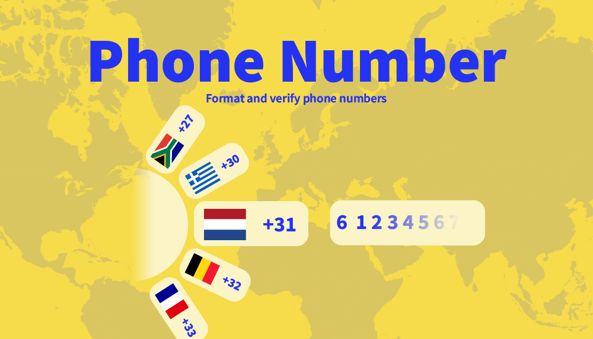

# DatoCMS Plugin: Phone Number

A powerful DatoCMS plugin that transforms standard fields into smart phone number inputs with country code selection. Validates and formats numbers according to international standards while providing flexible output options (text or JSON) to seamlessly integrate with your development workflow.



## ✨ Features

- **Global Phone Number Validation**: Eliminate invalid phone numbers in your data with support for all countries worldwide
- **Seamless Integration**: Built on [react-phone-number-input](https://www.npmjs.com/package/react-phone-number-input) and Google's [libphonenumber-js](https://www.npmjs.com/package/libphonenumber-js) for industry-standard validation
- **Flexible Field Support**: Works with both text fields and JSON fields
- **Smart Formatting**: When enabled on text inputs, automatically formats phone numbers to ensure consistency in your code
- **Rich Data**: When used with JSON fields, provides the phone number with valuable additional metadata

The plugin ensures you'll never worry about invalid phone numbers in your DatoCMS projects again. Simply enable it on your desired fields and enjoy reliable, properly formatted phone data throughout your content.

## 📋 Setup & Usage

### Installation

Add this plugin via DatoCMS Settings > Plugins > Add (`/admin/plugins/new`).

### Enabling on a Field

1. Navigate to your model settings in DatoCMS
2. Select the Text or JSON field you want to enhance
3. In the Presentation tab, select "Phone Number" from the Field Editor dropdown
4. Save your changes

### Configuration Options

- **Include countries**: Select countries you would like to include
- **Exclude countries**: Select countries you would like to exclude
- **Default country**: Select the default country. This will be automatically set when the field is empty

You can only use include or exclude countries, not both. When one is filled, the other is disabled. You will have to empty it before you can use the other. Based on the included or excluded countries the options in the default country will be updated.

### Data Output

- For Text fields: Stores the formatted international phone number as a string
  ```json
  {
    "phoneNumber": "+31612345678",
  }
  ```
- For JSON fields: Stores comprehensive phone data
  ```json
  {
    "phoneNumber": {
      "country": "NL",
      "countryCallingCode": "31",
      "nationalNumber": "612345678",
      "number": "+31612345678",
      "__countryCallingCodeSource": "FROM_NUMBER_WITH_PLUS_SIGN"
    }
  }
  ```

## 👥 Contributing
See [contributing.md](https://github.com/voorhoede/datocms-plugin-custom-page/blob/main/contributing.md).
